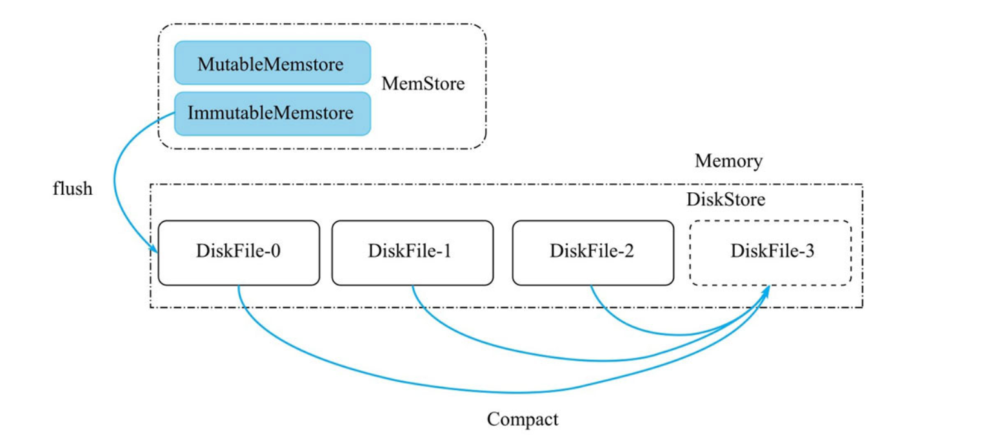
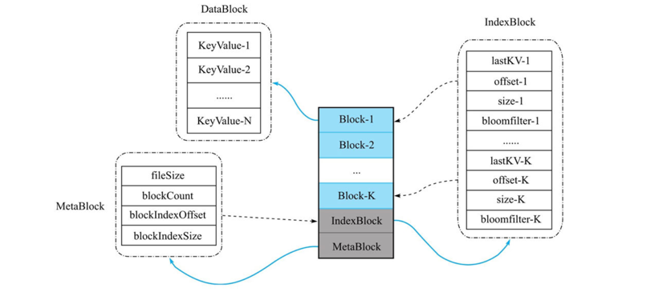
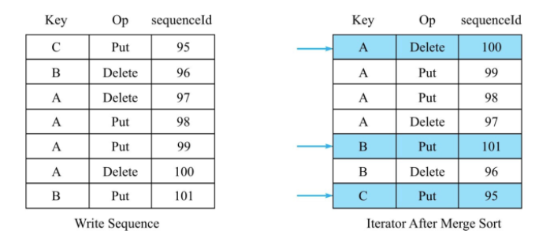

# MiniBase学习笔记
> https://github.com/pierre94/minibase

HBase相对复杂，想要快速啃下来比较困难。而MiniBase吸收了HBase最核心的引擎部分的精华，希望可以通过学习MiniBase以小见大，能够对自己理解HBase这个庞然大物有所帮助。

- 原项目: https://github.com/openinx/minibase
- 资料: 《HBase原理与实践#设计存储引擎MiniBase》 https://weread.qq.com/web/reader/632326807192b335632d09ckc51323901dc51ce410c121b

## 接口
- put/get/delete (点写\查\删)
- scan(范围查询)

## 核心架构架构
MiniBase是一个标准的LSM树索引结构，分内存部分和磁盘部分。


### MemStore
- 客户端不断地写入数据，当MemStore的内存超过一定阈值时，MemStore会flush成一个磁盘文件。
- MemStore分成MutableMemstore和ImmutableMemstore两部分
    - MutableMemstore由一个ConcurrentSkipListMap组成，容许写入
    - ImmutableMemstore也是一个ConcurrentSkipListMap，但是不容许写入
- 这里设计两个小的MemStore，是为了防止在f lush的时候，MiniBase无法接收新的写入。假设只有一个MutableMemstore，那么一旦进入flush过程，MutableMemstore就无法写入，而此时新的写入就无法进行。
> 从源码不难看出,其实就是2个ConcurrentSkipListMap kvMap和snapshot,flush的时候将kvMap赋值给snapshot,然后启动一个新的ConcurrentSkipListMap

### DiskStore

#### 基本概念
- DiskStore，由多个DiskFile组成，每一个DiskFile就是一个磁盘文件。
- ImmutableMemstore执行完flush操作后，就会生成一个新的DiskFile，存放到DiskStore中.
- 为了有效控制DiskStore中的DiskFile个数，我们为MiniBase设计了Compaction策略。目前的Compaction策略非常简单——当DiskStore的DiskFile数量超过一个阈值时，就把所有的DiskFile进行Compact，最终合并成一个DiskFile。
 
#### 核心问题与结构设计
- DiskFile必须支持高效的写入和读取。
    - 由于MemStore的写入是顺序写入，如果flush速度太慢，则可能会阻塞后续的写入，影响写入吞吐，因此flush操作最好也设计成顺序写。
    - LSM树结构的劣势就是读取性能会有所牺牲，如果在DiskFile上能实现高效的数据索引，则可以大幅提升读取性能，例如考虑布隆过滤器设计。
- DiskFile的数据必须分成众多小块(内存小磁盘大)。
    - 一次IO操作只读取一小部分的数据



DiskFile由3种类型的数据块组成，分别是DataBlock、IndexBlock、MetaBlock。

##### DataBlock
- 主要用来存储有序的KeyValue集合——KeyValue-1，KeyValue-2，…，KeyValue-N
- 一个DiskFile内可能有多个Block，具体的Block数量取决于文件内存储的总KV数据量

##### IndexBlock
IndexBlock:一个DiskFile内有且仅有一个IndexBlock,它主要存储多个DataBlock的索引数据。每个索引数据又包含4个字段:
- lastKV ：该DataBlock的最后一个KV。方便直接读取这个DataBlock到内存。
    > 为什么不是第一个kv?
- offset ：该DataBlock在DiskFile中的偏移位置，查找时，用offset值去文件中Seek，并读取DataBlock的数据。 
- size：该DataBlock占用的字节长度。
- bloomFilter：该DataBlock内所有KeyValue计算出的布隆过滤器字节数组。

##### MetaBlock
一个DiskFile中有且仅有一个MetaBlock；同时MetaBlock是定长的，因此可以直接通过定位diskf ile.f ilesize - len(MetaBlock)来读取MetaBlock，而无需任何索引.
- fileSize ：该DiskFile的文件总长度，可以通过对比这个值和当前文件真实长度，判断文件是否损坏
- blockCount：该DiskFile拥有的Block数量
- blockIndexOffset：该DiskFile内的IndexBlock的偏移位置，方便定位到IndexBlock。
- blockIndexSize：IndexBlock的字节长度。

##### DiskStore读取示例
假设用户需要读取指定DiskFile中key='abc'对应的value数据，那么可以按照如下流程进行IO读取
- 因为MetaBlock的长度是定长的，所以很容易定位到MetaBlock的位置并读取信息
- 根据MetaBlock.blockIndexOffset等信息读取到IndexBlock信息
- 由于IndexBlock中存储着每一个DataBlock对应的数据区间，通过二分查找可以很方便定位到key='abc'在哪个DataBlock中
    > 需要key有序,假如key无序怎么办？ConcurrentSkipListMap保证了数据集合内是有序的
- 再根据对应的DataBlock的offset和size，就能顺利完成DataBlock的IO读取

## kv设计
在MiniBase中，只容许两种更新操作：
- Put操作
- Delete操作

### 结构设计
```java
  private KeyValue(byte[] key, byte[] value, Op op, long sequenceId) {
    assert key != null;
    assert value != null;
    assert op != null;
    assert sequenceId >= 0;
    this.key = key;
    this.value = value;
    this.op = op;
    this.sequenceId = sequenceId;
  }
```
- Op有Put和Delete两种操作类型
- 每一次Put/Delete操作分配一个自增的唯一sequenceId. 读取的时候，只能得到小于等于当前sequenceId的Put/Delete操作，这样保证了本次读取不会得到未来某个时间点的数据，实现了最简单的Read Committed的事务隔离级别。

KeyValue在MemStore和DiskFile中都是有序存放的，所以需要为KeyValue实现Comparable接口，如下所示：
```java
  @Override
  public int compareTo(KeyValue kv) {
    if (kv == null) {
      throw new IllegalArgumentException("kv to compare should not be null");
    }
    int ret = Bytes.compare(this.key, kv.key);
    if (ret != 0) {
      return ret;
    }
    if (this.sequenceId != kv.sequenceId) {
      return this.sequenceId > kv.sequenceId ? -1 : 1;
    }
    if (this.op != kv.op) {
      return this.op.getCode() > kv.op.getCode() ? -1 : 1;
    }
    return 0;
  }
```
- k小的在前面。后面读取的时候就像二分查找了。
- 注意在Key相同的情况下，sequenceId更大的KeyValue排在更前面，这是因为sequenceId越大，说明这个Put/Delete操作版本越新，它更可能是用户需要读取的数据
- 再比较op code (锦上添花,防止上游数据错乱发来一样的sequenceId？)

### 写入流程详细剖析
写入过程需要构造一个kv结构(put/delete)，并加上一个自增的sequenceId.详见`MStore#put`
```java
  @Override
  public void put(byte[] key, byte[] value) throws IOException {
    this.memStore.add(KeyValue.createPut(key, value, sequenceId.incrementAndGet()));
  }
```
 > (MiniBase是本地生成,HBase应该要由服务端生成?)

kv数据是写到kvMap中,其中kvMap就是ConcurrentSkipListMap结构。这里我们需要关注:
- dataSize更新问题
    由于ConcurrentSkipListMap在put进数据后会返回相同key的旧value,所以需要考虑一下dataSize的更新(当前MemStore内存占用字节数，用于判断是否达到Flush阈值)。
- 锁
    需要使用一个读写锁updateLock来控制写入操作和Flush操作的互斥

这里详见:`MemStore#add`
```java
  public void add(KeyValue kv) throws IOException {
    // add前需要阻塞flush
    flushIfNeeded(true);
    updateLock.readLock().lock();
    try {
      KeyValue prevKeyValue;
      // ConcurrentSkipListMap特性 put后的返回值 the old value, or null if newly inserted
      if ((prevKeyValue = kvMap.put(kv, kv)) == null) {
        // 之前kv不存在则直接加
        dataSize.addAndGet(kv.getSerializeSize());
      } else {
        // 之前kv存在,需要计算差值(可能有更新)
        dataSize.addAndGet(kv.getSerializeSize() - prevKeyValue.getSerializeSize());
      }
    } finally {
      updateLock.readLock().unlock();
    }
    flushIfNeeded(false);
  }
```
写入MemStore后,当数据量达到一定阈值就要将flush到DiskStore

### 读取流程详细剖析

> 读取流程相对要复杂很多。

我们需要从多个有序集合中读取数据:
- MemStore
    - MutableMemstore:kvMap
    - ImmutableMemstore:snapshot
- DiskStore:多个DiskFile

在Scan的时候，需要把多个有序集合通过多路归并算法合并成一个有序集合，然后过滤掉不符合条件的版本，将正确的KV返回给用户。


以上图为例，我们要将上面7个KV数据再次处理得到最终的结果。

对于同一个Key的不同版本，我们只关心最新的版本。假设用户读取时能看到的sequenceld≤101的数据，那么读取流程逻辑如下：
- Key=A的版本
    我们们只关注（A,Delete,100）这个版本，该版本是删除操作，说明后面所有key=A的版本都不会被用户看到。
- Key=B的版本
    我们只关心（B,Put,101）这个版本，该版本是Put操作，说明该Key没有被删除，可以被用户看到。
- Key=C的版本
    我们只关心（C,Put,95）这个版本，该版本是Put操作，说明该Key没有被删除，可以被用户看到。
   
对于全表扫描的scan操作，MiniBase将返回（B,Put,101）和（C,Put,95）这两个KeyValue给用户。

详情见: `MStore#ScanIter`    

